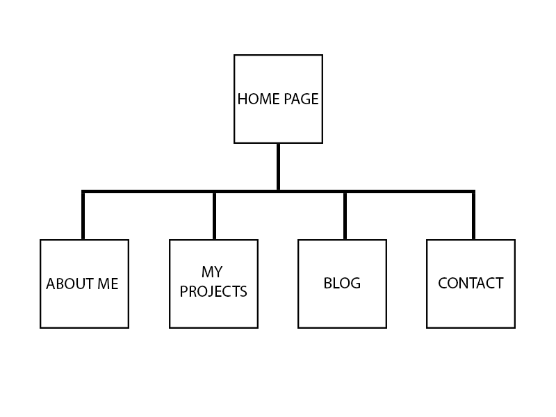

### What are the 6 Phases of Web Design?
  -Gather information necessary to the project and understand all of the requirements.

  -Planning the project. Creating a site map and figuring out how all of the components of the site come together.

Example: 

  -Design. This is where the markups are done to show the client a few different ways he/she envisions the site.

  -Developing the site. Taking in everything prior to this and using it to create a functioning site.

  -Testing the site to make sure it is fully functional.

  -Maintaining the site and updating it at a clients' request.

### What is your site's primary goal or purpose? What kind of content will your site feature?

  The primary purpose of my site is to give potential employers a better understanding of who I am and encourage them to contact me at least for an interview. My site will be basic in terms of content but complex enough to show that I am more than capable of handling a junior developer position.
  - An about me page to give more insight as to who I am as a person.
  - A projects page to show some of my best work at DBC and to also showcase works that I have done with my partner so that employers can be encouraged to look at their site as well and see that I am a team player and can work with others. Hopefully they'll hire both of us haha.
  - A blog page to give an employer an understanding of my dedication to the program and the knowledge I have gained.
  - A contact page for employers to be able to connect with me.

### What is your target audience's interests and how do you see your site addressing them?

  My target audience should have an interest in hiring junior developers and also be in a position to do so. I see my site addressing them in a very friendly way. Kind of saying "Hey I'm Elan. Just take a look and poke around. If you like me, contact me. If not, hey let's just connect via linkedin and keep in touch just in case." I want my site to embed my name in the viewers mind. Leaving a good impression is key.

### What is the primary "action" the user should take when coming to your site? Do you want them to search for information, contact you, or see your portfolio? It's ok to have several actions at once, or different actions for different kinds of visitors.

  I want my user to automatically feel like they should be contacting me. Straight from the home page. I want there to be this feeling of trust that this person knows what he's doing. Essentially I want to attract users to cold call me as soon as they land on my page.

### What are the main things someone should know about design and user experience?

  I think the main things someone should fully understand about design and user experience is that it will not cater to everyone. It is impossible to build something without some kind of flaws. Going into designing with the thinking that it will be something everyone will love will be a huge downfall in the end. I can argue that Apple is the best but the majority of the world uses Windows. It's just different from person to person. You can't please everyone so please your client. Also I agree with the article about storytelling. I think design has a lot to do with that. Learn to be a good story teller and you can create a fantasic design for your site.

### What is user experience design and why is it valuable?

  User experience design is the process of designing a system that keeps in mind how the end-user would ultimately feel with it. This is extremely important. You can build something complex and functional and it can do wonders for you but if users don't feel good about it, someone else will design the same thing but keep the users in mind. Nowadays, a website can have so many components to it that a user can be overwhelmed. User experience design aims at making the user feel comfortable.

### Which parts of the challenge did you find tedious?

  The thing I find most tedious is the reading. I love to read books but reading off of a screen can get very tedious and one article had a lot to read. Aside from that, nothing tedious at all.