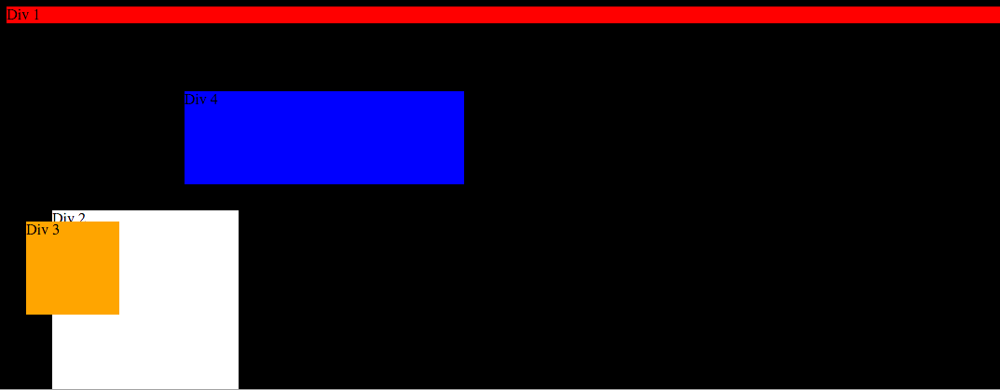
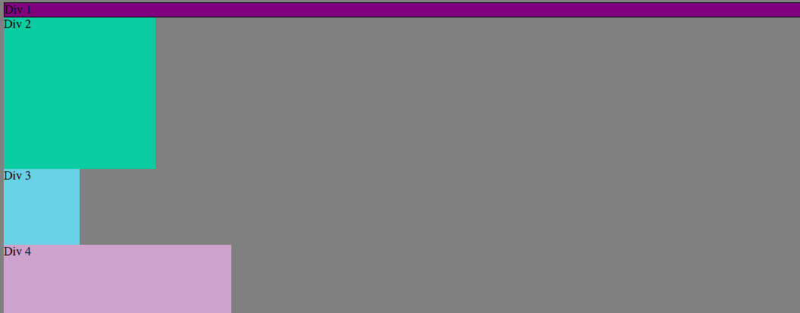
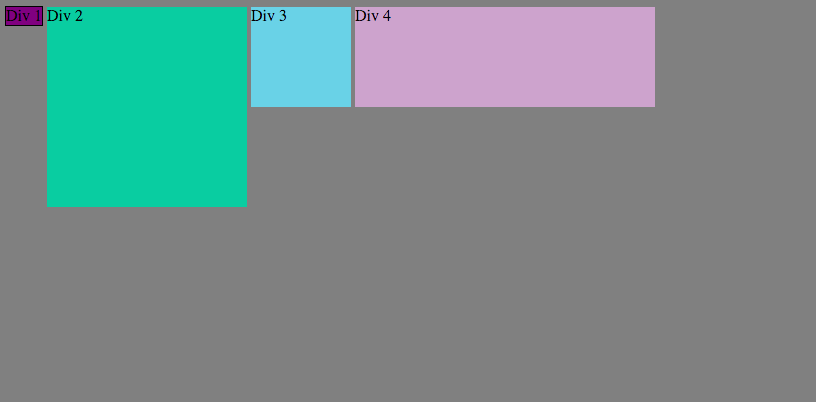
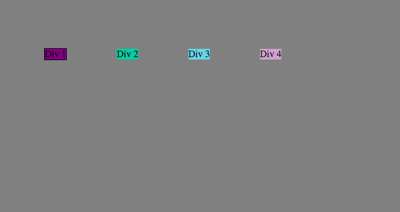
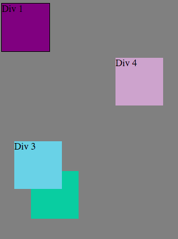
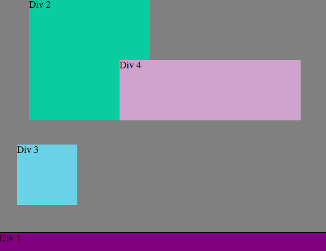
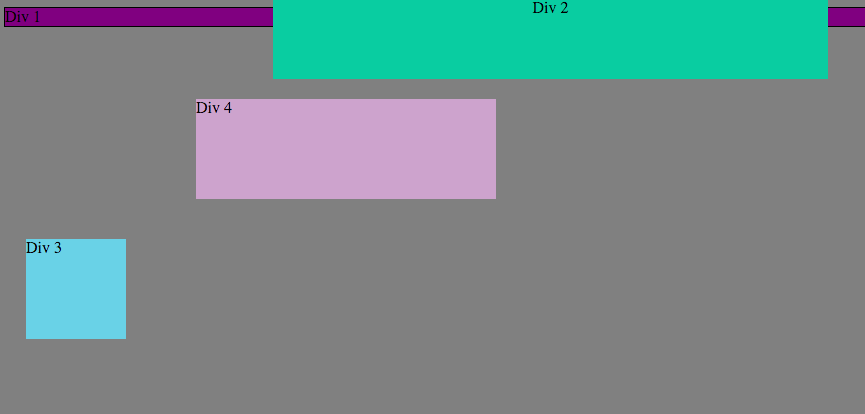
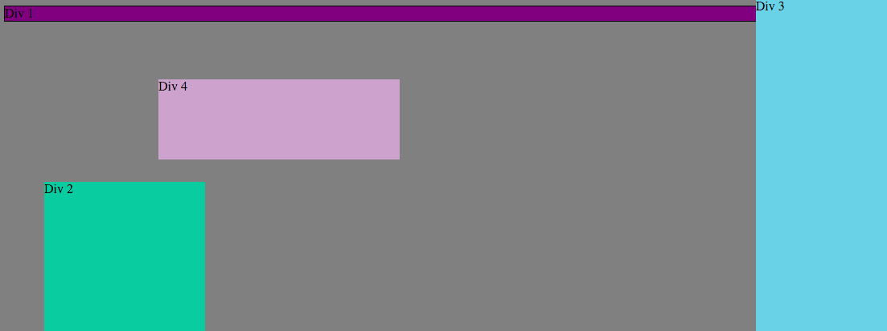
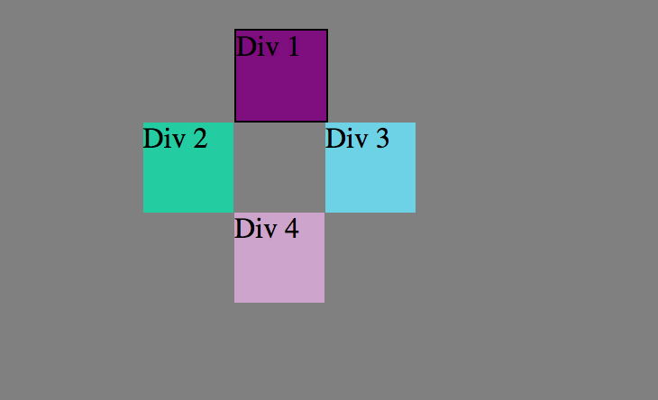

###How can you use Chrome's DevTools inspector to help you format or position elements?

  - Chrome's Dev tools allows for easy manipulation of elements in order to help you as a developer to quickly and efficiently write and test your code.

###How can you resize elements on the DOM using CSS?

  - You can edit the width and height of the elements.

###What are the differences between absolute, fixed, static, and relative positioning? Which did you find easiest to use? Which was most difficult?

  - Absolute positions the element relative to its first positoned ancestor element, fixed positions the element relative to the browser window, static positions the element to its default value, relative positions the element relative to its normal position.

###What are the differences between margin, border, and padding?

  - Margin sets the space around the exterior sides of an element. Padding sets the space on the interior sides of an element. Border creates a border around the element.

###What was your impression of this challenge overall? (love, hate, and why?)

  - This challenge was a good tool to practice our positioning. We liked it.

        
