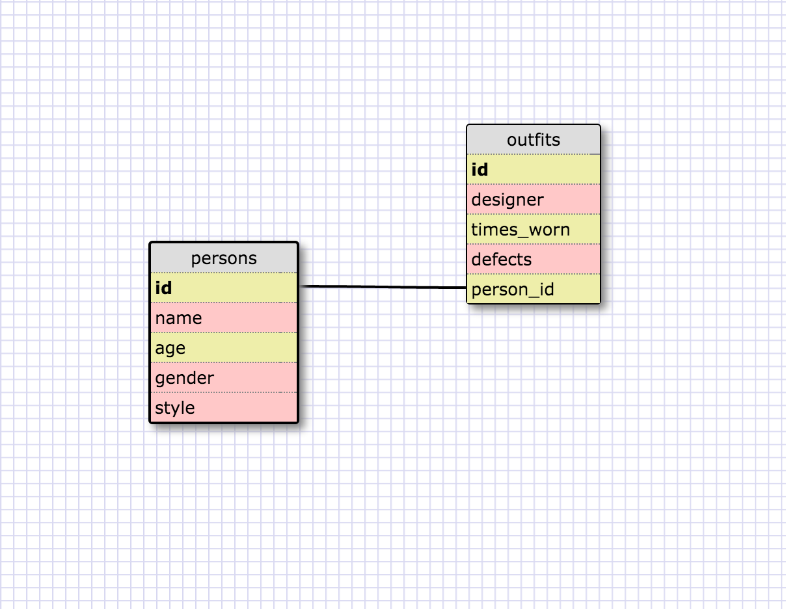

## Database Intro

##### Select all data for all states

`SELECT * FROM states;`

##### Select all data for all regions

`SELECT * FROM regions;`

##### Select the state_name and population for all states

`SELECT state_name, population FROM states;`

##### Select the state_name and population for all states ordered by population. The state with the highest population should be at the top.

`SELECT state_name, population FROM states`
`ORDER BY population DESC;`

##### Select the state_name for the states in region 7

`SELECT state_name FROM states`
`WHERE region_id = 7;`

##### Select the state_name and population_density for states with a population density over 50 ordered from least to most dense

`SELECT state_name, population_density FROM states`
`WHERE population_density > 50`
`ORDER BY population_density ASC;`

##### Select the state_name for states with a population between 1 million and 1.5 million people

`SELECT state_name FROM states`
`WHERE population BETWEEN 1000000 AND 1500000;`

##### Select the state_name and region_id for states ordered by region in ascending order

`SELECT state_name, region_id FROM states`
`ORDER BY region_id ASC;`

##### Select the region_name for the regions with "Central" in the name

`SELECT region_name FROM regions`
`WHERE region_name LIKE '%Central%';`

##### Select the region_name and the state_name for all states and regions in ascending order by region_id. Refer to the region by name. (This will involve joining the tables)

`SELECT region_name, state_name FROM regions JOIN states`
`WHERE regions.id = states.region_id;`

## Reflection

#### What are databases for?

  - Databases are systems created solely for the storing and manipulation of data. They are extremeley powerful and can hold massive amounts of data.

#### What is a one-to-many relationship?

  - A one-to-many relationship is when one table can reference data in another table many times. This is very useful. Also, there is such a thing as many-to-one relationship which is the opposite.

#### What is a primary key? What is a foreign key? How can you determine which is which?

  - A primary key is a unique identifier located in the main table of a one-to-many relationship database. The foreign keys are located in the tables being linked to the main table. This can be thought of as something similar to Ruby classes and their methods. Or even classes and child-classes.

#### How can you select information out of a SQL database? What are some general guidelines for that?

  - In order to select information from a SQL database, you must first specify the kind of data you want to select. For instance, if I have a column called name in a table called names and I want to select all the names in the name column, I can query the following:    `SELECT name FROM names` . The SELECT keyword is what begins the selection process of any data in the databse. What follows after is what you will be selecting and where to select from.

