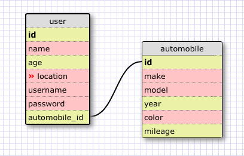
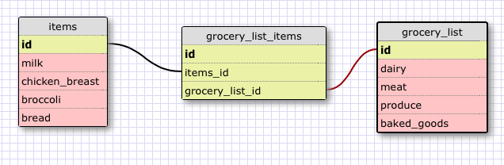

## More Schemas

###### I worked on this challenge with Ena.

###One-to-one Schema:

This relationship is a one-to-one because it's looking at a singe user and connecting an automobile_id to another table that expands more info on the user's automobile. The user can of course not have an automobile and this would still work. It would just be NULL instead.

###One-to-many Schema:

##Reflection:

#### What is a one-to-one database?

  - A one-to-one database is when two objects have a single relationship. This means that the original object can only have one or none (NULL) of the attribute objects.

#### When would you use a one-to-one database? (Think generally, not in terms of the example you created).

  - You would use a one-to-one database when you wanted to be more specific and store more inforamtion about an attribute of an object.

#### What is a many-to-many database?

  - A many-to-many database is where more than one row within the table are associated with more than one row in another table.

#### When would you use a many-to-many database? (Think generally, not in terms of the example you created).

  - You would use a many to many database when you have a lot of data that needs to be associated with multiple other pieces of data.

#### What is confusing about database schemas? What makes sense?

  - I'm confused as to how many to many databases actually work and how they would be implemented in a real world situation. Also, how the data flow works between them. One-to-one relationships make sense to me.